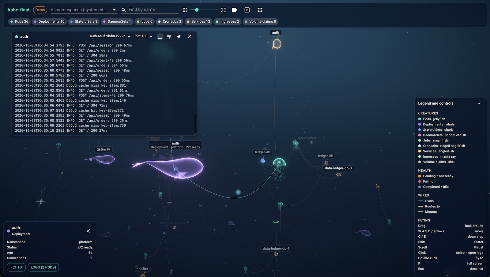

# kube-float



See a Kubernetes cluster as a dark ocean. Pods drift as translucent jellyfish,
the things around them swim as whales, sharks and rays, their relationships
hang between them as slack wires, and you fly through it all. Click a pod, or
anything that runs pods, to read the logs in a floating window.

kube-float is read-only. It cannot change a cluster.

## Quick start

You need Node 18 or newer, Yarn, and `kubectl` already pointing at a cluster.

```sh
yarn install
yarn start
```

Then open http://localhost:3000.

No cluster handy? `yarn demo` runs the same app against a built-in, invented
cluster. The app also falls back to the demo by itself when it cannot reach a
cluster, and adding `?demo` to the address forces it.

Every feature is described in [docs/features.md](docs/features.md).

## What you are looking at

| Kind | Creature |
| --- | --- |
| Pod | Jellyfish |
| Deployment | Whale |
| StatefulSet | Shark |
| DaemonSet | School of fish |
| Job | Small fish |
| CronJob | Angelfish in a ring |
| Service | Anglerfish |
| Ingress | Manta ray |
| PersistentVolumeClaim | Shell |

A healthy creature has the colour of its kind. Orange means pending or not
ready, red means failing, grey-blue means completed or scaled to zero.

Wires show who owns what (blue), where traffic is routed (gold) and which
volumes are mounted (sand). ReplicaSets are left out; pods are wired straight
to their Deployment.

## Flying

| Input | Action |
| --- | --- |
| Drag | Look around |
| `W` `A` `S` `D` or arrow keys | Move |
| `Q` / `E` | Down / up |
| `Shift` | Faster |
| Scroll | Thrust forwards or backwards |
| Click | Select; on a pod or anything that runs pods, open the logs |
| Double-click | Fly to that creature |
| `F` | Full screen |
| `Esc` | Deselect |

Leave it alone for a while and the camera circles slowly.

The toolbar filters by namespace and kind, finds things by name, and has a
spacing slider that pulls everything closer together or apart.
Namespaces starting with `kube-` are hidden until you pick them. Presentation
mode hides the controls along with namespaces, node names, addresses and
hostnames, for showing a cluster to people outside your team.

## How it reaches your cluster

`yarn start` runs two things:

1. `kubectl proxy` on `127.0.0.1:8717`. It uses your current kubectl context,
   so your credentials stay where they already are.
2. The web app. Its dev server forwards `/k8s/...` to that proxy.

The dev server only forwards `GET` requests, and only for listing the kinds in
the table above and reading pod logs. Everything else is refused, including
Secrets and ConfigMaps, which kube-float never reads.

To look at another cluster, switch context (`kubectl config use-context ...`)
and restart. To use a proxy that is already running elsewhere, set
`KUBE_FLOAT_PROXY`, for example `KUBE_FLOAT_PROXY=http://127.0.0.1:8001 yarn web`.

Two things to keep in mind:

- While it runs, anything on your machine can read the same cluster data
  through `localhost:3000/k8s`. Do not expose that port to a network.
- Pod logs can contain personal or secret data, and they appear on screen.
  They are streamed to your browser and stored nowhere.

## Scripts

| Command | What it does |
| --- | --- |
| `yarn start` | `kubectl proxy` plus the app |
| `yarn web` | The app only |
| `yarn demo` | The app with the demo cluster |
| `yarn build` | Production build of the interface |

The production build has no proxy of its own. It expects something to serve
the Kubernetes API under `/k8s`.

## Built with

Create React App, [three.js](https://threejs.org) through
[react-three-fiber](https://github.com/pmndrs/react-three-fiber),
[Material UI](https://mui.com) and
[d3-force-3d](https://github.com/vasturiano/d3-force-3d).

## License

MIT. Copyright (c) 2026 [rmd Studio Inc.](https://www.rmdstudio.com)
Contact: info@rmdstudio.com
